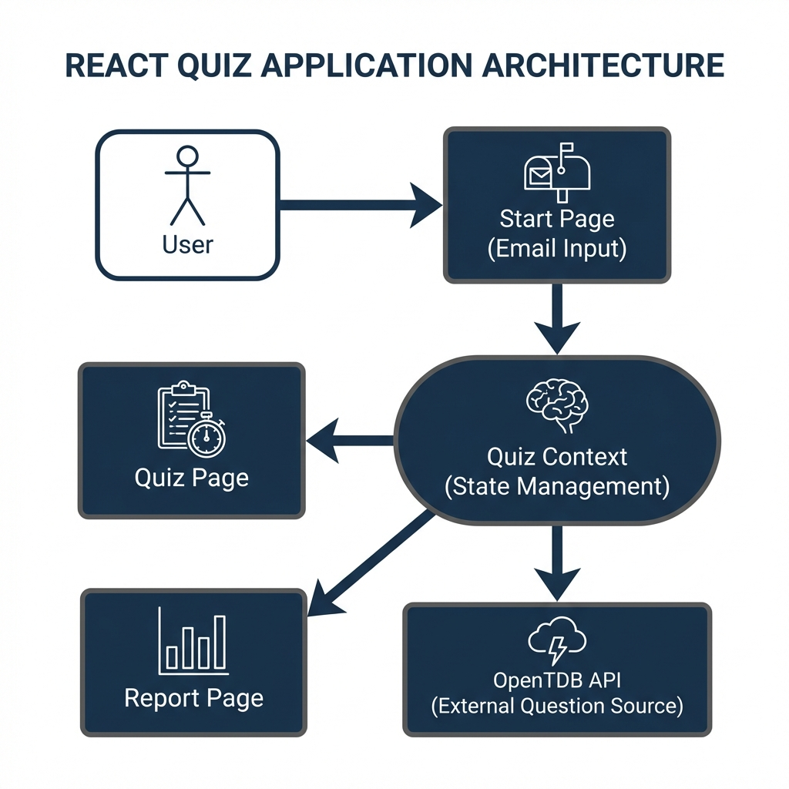

# Quiz Application

A premium React-based Quiz Application that tests your knowledge with questions from the OpenTDB API.

## Features

- **User Onboarding**: Simple email entry to start.
- **Dynamic Quiz**: 15 random questions fetched from OpenTDB.
- **Timer**: 30-minute countdown with auto-submit.
- **Navigation**:
    - Skip to any question via the Overview Panel.
    - Track "Visited", "Attempted", and "Current" states visually.
- **Report**: detailed breakdown of your answers vs correct answers.
- **Responsive Design**: Mobile-friendly layout.
- **Error Handling**: Robust API fetching with retry capability (manual reload).

## Tech Stack

- **Framework**: React (Vite)
- **Styling**: CSS Variables, Custom Dark Theme
- **Routing**: React Router DOM
- **Icons**: Lucide React
- **State Management**: React Context API

## Architecture



## Setup Instructions

1. **Clone the repository**:
   ```bash
   git clone <repository-url>
   cd quiz-application
   ```

2. **Install dependencies**:
   ```bash
   npm install
   ```

3. **Run locally**:
   ```bash
   npm run dev
   ```
## Assumptions & Challenges

- **API Limits**: The OpenTDB API has rate limits. If you spam requests, it might return an empty response code. The app handles this by showing an error.
- **State Persistence**: The current version uses memory state (Context). Refreshing the page will reset the quiz (as a security/anti-cheating measure, and simplicity).
- **Timer**: The timer runs in the background but is tied to the component lifecycle.

## Approach

I chose a **Context-based architecture** to avoid prop-drilling, especially for the Timer and Navigation components which need access to global quiz state.
The UI follows a **premium dark aesthetic** to feel modern and engaging, moving away from standard Bootstrap/Tailwind defaults.
